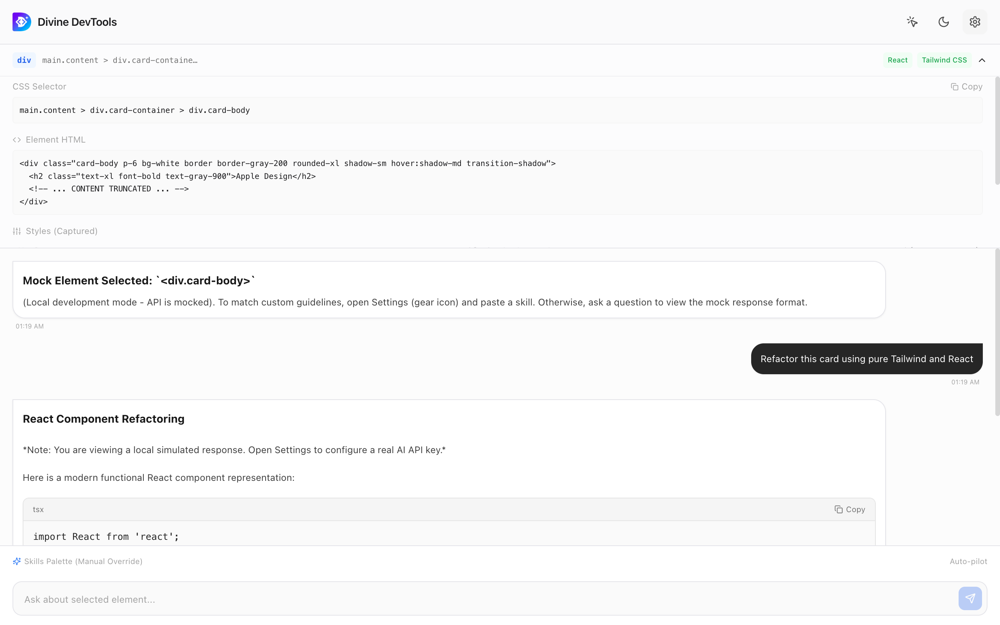
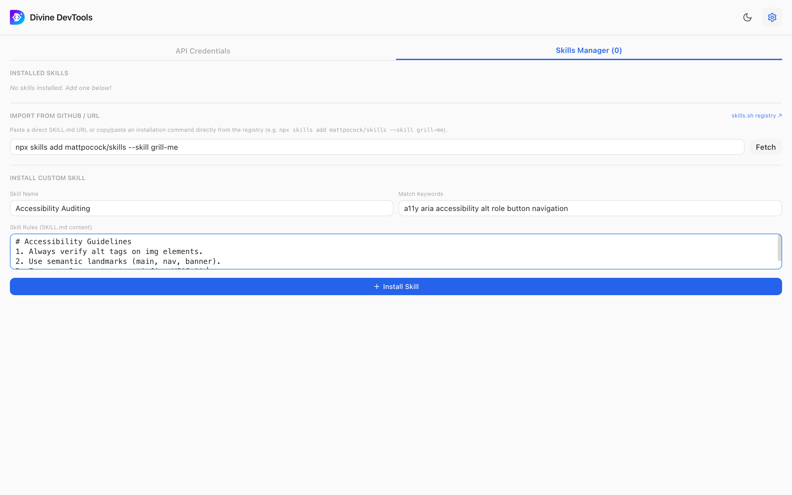
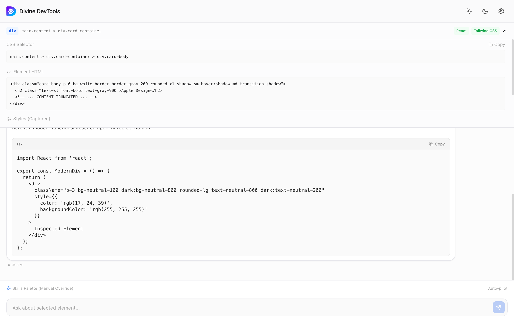

# Divine DevTools: Visual DOM Inspector & AI Side Panel

<p align="left">
  <a href="https://chromewebstore.google.com/detail/divine-devtools/pjikjddacfknmdbdeliecpbolciebmbf">
    
  </a>
</p>

[](https://chromewebstore.google.com/detail/divine-devtools/pjikjddacfknmdbdeliecpbolciebmbf)
[](https://chromewebstore.google.com/detail/divine-devtools/pjikjddacfknmdbdeliecpbolciebmbf)
[](https://chromewebstore.google.com/detail/divine-devtools/pjikjddacfknmdbdeliecpbolciebmbf)

Divine DevTools is a premium visual DOM inspector and AI assistant that lives directly in your **Chrome Side Panel** (registered natively via Manifest V3). It enables developers to inspect components on active web pages and get context-aware answers, migrations, and accessibility audits following custom developer guidelines (`SKILL.md`).

---

## Key Capabilities

### 🔍 1. Visual DOM Inspector
Point-and-click cursor selector highlighting nodes inside an isolated Shadow DOM overlay. Instantly captures tag name, CSS selectors, computed key styles, and HTML source code.

<p align="center">
  
</p>

---

### 📜 2. Dynamic Skills Palette
Install custom developer coding standards (e.g. your company's React guidelines or style conventions). Rules are auto-matched based on selectors, tech-stack, or search terms and dynamically injected into prompts.

<p align="center">
  
</p>

---

### 🤖 3. Grounded AI Assistant & Multi-Provider Settings
Ask design and refactoring questions side-by-side with your page context. Select between Gemini, OpenAI, Claude, DeepSeek, Groq, or local Ollama LLMs with clean code blocks, copy utilities, and markdown rendering.

<p align="center">
  
</p>

---

## Installation & Setup

### 1. Chrome Web Store (Recommended)
Get the approved build from the [Chrome Web Store](https://chromewebstore.google.com/detail/divine-devtools/pjikjddacfknmdbdeliecpbolciebmbf):
1. Click **Add to Chrome** on the listing.
2. Pin the extension to your toolbar.

### 2. Manual Development Build (From Source)
Ensure you have Node.js (v18+) and `pnpm` (or `npm`) installed.
```bash
# Clone the repository and build
cd extension
pnpm install
pnpm build

# Load in Chrome:
# 1. Open chrome://extensions/ and enable "Developer mode".
# 2. Click "Load unpacked" and select the extension/dist/ folder.
```

---

## How to Use

1. Click the **Divine DevTools** icon in your toolbar to open the AI side panel.
2. Click the **Inspect** button (crosshair icon) in the header.
3. Select any element on your page.
4. Open **Settings** (gear icon) to configure credentials and add skills guidelines.
5. Chat with the AI helper (e.g., *"Convert this header styling to Tailwind"* or *"Suggest accessibility fixes"*).

---

## Development Mode

To build and compile changes live as you edit panel layouts:
```bash
cd extension
pnpm dev
```
